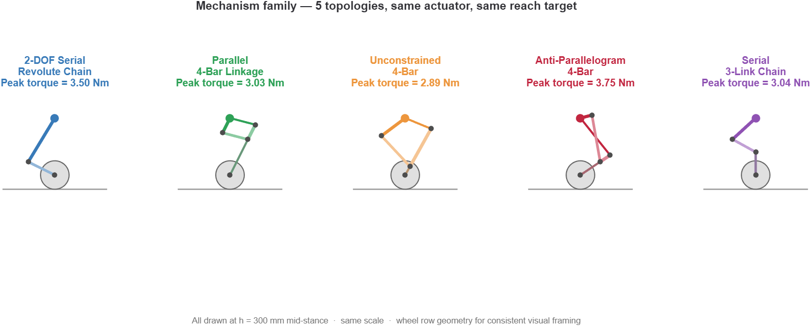
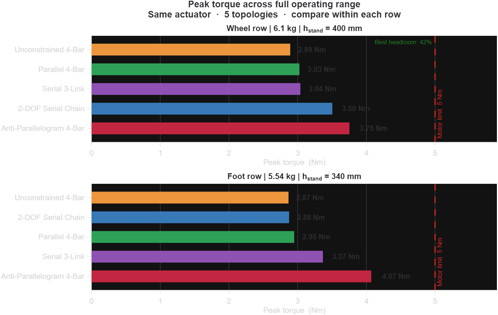
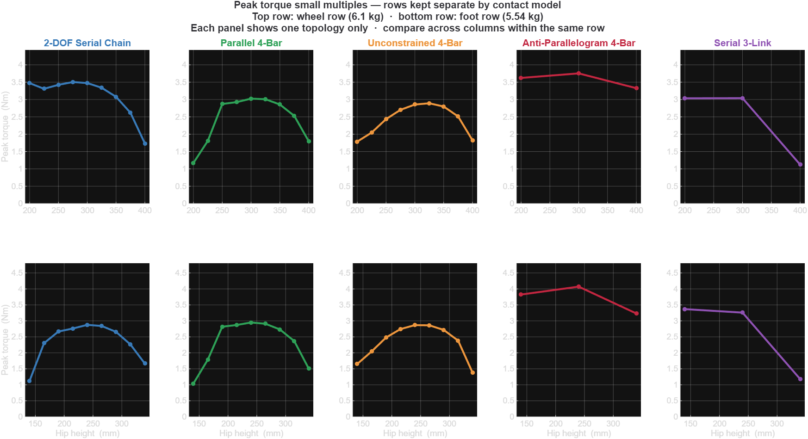
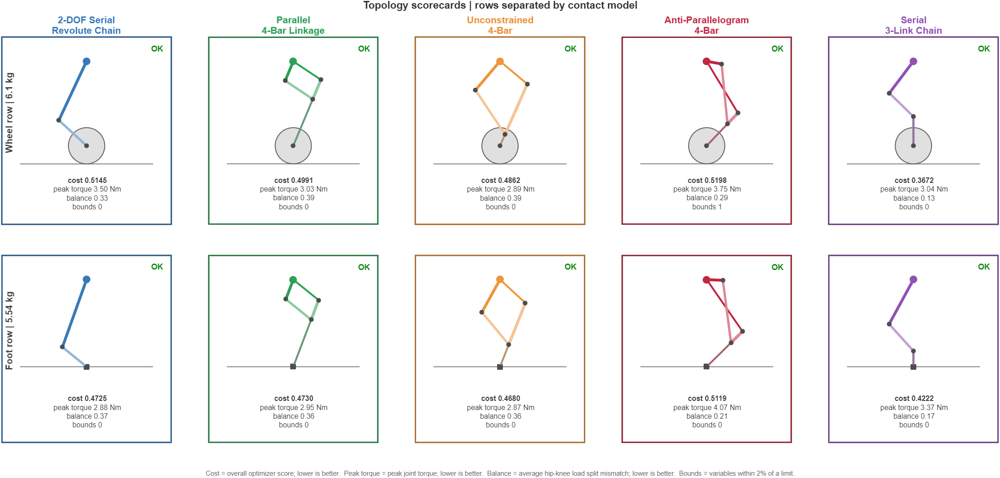

# Webber - A Wheeled Bi-Pedal Robot(WBR): Topology Study and Optimization

**Date:** April 8, 2026.

This study started from a practical constraint rather than a research question.

The motors had already been chosen. That decision came first, mainly because of the cost and time constraints. Papers on wheel-legged mechanisms were useful for understanding the trade-offs between topologies: workspace, torque distribution, packaging, and how each behaved near its limits. What papers could not tell me was whether a specific mechanism would work for my motors, my mass, my reach target, under the loading conditions my robot actually saw.

With limited budget and time, building the wrong mechanism first was not an option. So instead of picking a topology based on precedent or on what looked right in someone else's paper, I validated everything analytically before anything went into CAD: five mechanisms, the same actuator constraints, the same optimizer pipeline, across both contact configurations that Webber actually used.

Webber rolled on wheels and walked on feet. Both were real operating modes. The study had to cover both, for a total of `10` cells.

This represented roughly three weeks of work, which was why the blog ended up longer than usual.

---

## The Five Topologies

Before getting into the results, it was worth understanding what each topology brought to the comparison and why it was included.

All five were drawn at mid-stance (`h = 300 mm`) in wheel-row contact geometry, at consistent scale. That figure was there for a reason. Where the joints sat relative to the wheel, how much of the linkage extended laterally, and how the anti-parallelogram coupler crossed were the structural differences the optimizer worked with, and they were not visible in a cost score.

- **serial 2R chain**: 2-DOF serial revolute chain, no closed loop. This was the complexity baseline. Every four-bar result was understood in comparison to this.
- **parallel 4-bar**: parallel 4-bar linkage. This was the build candidate if the study confirmed that it cleared actuator limits with acceptable margins across both contact modes.
- **unconstrained 4-bar**: unconstrained 4-bar with full freedom on all link ratios and no imposed symmetry. The question this topology answered was whether unconstrained search found something better than the parallel 4-bar.
- **anti-parallelogram 4-bar**: anti-parallelogram 4-bar. It was kinematically distinct from the standard four-bar in ways that became significant near workspace limits.
- **serial 3-link chain**: serial 3-link chain with femur, tibia, and passive foot as a serial revolute chain. Why this model was used instead of a symmetric 5-bar was covered below.

---

## The Thing That Had to Be Right Before the Numbers Meant Anything

Before I looked at any results, there was a question about how to structure the comparison that turned out to be the most consequential decision in the study.

The two contact configurations were not the same physical problem:

- **Wheel contact**: robot mass `6.1 kg`, wheel radius `60 mm`, ground reaction at the wheel axle
- **Foot contact**: robot mass `5.54 kg`, point contact at the foot tip

Because mass and contact geometry differed, the loading at the hip also differed. An optimizer minimizing actuator torque under wheel-contact conditions was not solving the same objective as one minimizing under foot-contact conditions. If I had ranked all ten results on one global table, I would have been collapsing two separate engineering problems into a single leaderboard.

The correct structure was to rank each topology against the other four within its own row. Across rows, what mattered was whether a topology held its place when the contact configuration changed.

Two topologies in this study swapped ranks between rows. A single-configuration study would have returned the wrong ranking for one of them, depending entirely on which contact row was run.

---

## What the Numbers Showed

The cost column was the optimizer's weighted objective: a normalized measure of actuator loading across the full posture sweep. Lower cost meant more uniform torque demand throughout the workspace, not just a lower peak at one extreme. Peak torque was reported separately because a topology could have a low cost while still producing a narrow spike that the scalar alone did not reveal.

`serial 3-link chain` was the clearest example of why both columns mattered: it was the lowest-cost topology in both rows without having the lowest peak torque in either row.

**Wheel contact** (`r_wheel = 60 mm`, `6.1 kg`):

| Topology | Cost | Peak Torque | % of 5 Nm Limit | Rank |
|---|---|---|---|---|
| serial 3-link chain | 0.3672 | 3.04 Nm | 60.8% | 1 |
| unconstrained 4-bar | 0.4862 | 2.89 Nm | 57.8% | 2 |
| parallel 4-bar | 0.4991 | 3.03 Nm | 60.5% | 3 |
| serial 2R chain | 0.5145 | 3.50 Nm | 70.1% | 4 |
| anti-parallelogram 4-bar | 0.5198 | 3.75 Nm | 75.1% | 5 - bound-active |

**Foot contact** (`r_wheel = 0 mm`, `5.54 kg`):

| Topology | Cost | Peak Torque | % of 5 Nm Limit | Rank | Notes |
|---|---|---|---|---|---|
| serial 3-link chain | 0.4222 | 3.37 Nm | 67.3% | 1 | |
| unconstrained 4-bar | 0.4680 | 2.87 Nm | 57.3% | 2 | |
| serial 2R chain | 0.4725 | 2.88 Nm | 57.5% | 3 | |
| parallel 4-bar | 0.4730 | 2.95 Nm | 59.0% | 4 | |
| anti-parallelogram 4-bar | 0.5119 | 4.07 Nm | 81.4% | 5 | thermal warning |

Three things in the table were worth pulling apart:

**anti-parallelogram 4-bar exceeded the `4.0 Nm` continuous thermal limit in the foot row.** The optimizer did not catch this during the run because the cost function used the `5 Nm` transient peak as the feasibility bound, not the continuous limit. Finding it in post-processing rather than during optimization exposed a gap in the current pipeline. The continuous limit had to enter the feasibility check, not only the summary.

**serial 2R chain and parallel 4-bar swapped ranks.** serial 2R chain was 4th in wheel contact and 3rd in foot contact. parallel 4-bar was 3rd in wheel contact and 4th in foot contact. They exchanged positions between rows. Running one contact row would have put one of them above the other, and it would have been the wrong one depending on which row had been chosen.

**serial 3-link chain ranked 1st in both rows on cost, while unconstrained 4-bar had the lowest peak torque in both rows.** That split was important. The cost winner and the peak-torque winner were different, which was exactly why both the scalar objective and the peak column needed to be shown.

---

## What the Summary Table Could Not Show

The cost and peak torque numbers were scalars. They did not show whether a topology's actuator demand was distributed evenly across the workspace or concentrated into a narrow window.

Fig. 3 showed peak joint torque versus hip height for each topology. The top row was wheel contact. The bottom row was foot contact. The comparison had to be made across columns within the same row, because the y-axis scales were consistent within each row.

The thing that surprised me here was anti-parallelogram 4-bar.

The peak torque number looked bad in the table. The profile showed why it could not be fixed. The torque curve did more than peak; it steepened sharply near the workspace boundary in both rows. That steep slope came from the anti-parallelogram geometry's mechanical disadvantage at extension. When the coupler and frame link approached a near-singular configuration, the Jacobian-based torque estimate rose quickly. The optimizer saw this cost, tried to avoid it, and hit the link-length bound instead. At this scale, that behavior was baked into the geometry.

unconstrained 4-bar (orange) stayed relatively flat across the posture range in both rows. parallel 4-bar showed a similar shape but with a higher floor. serial 2R chain rose more steeply at extended-reach postures in the wheel row, which was part of why it trailed parallel 4-bar there even though the two swapped positions in the foot row.

serial 3-link chain was almost the opposite story. Its peak torque was not the lowest, but it avoided the steep late-range growth that hurt the weaker profiles, so its demand stayed distributed well enough across the sweep to win on cost in both rows.

A flat torque profile was not just a nicer number. It meant the actuator was operating efficiently across the full workspace, not just clearing a peak at one edge.

The cost difference between unconstrained 4-bar and parallel 4-bar was marginal: `0.013` in wheel contact and `0.005` in foot contact. At that delta, the profiles alone did not settle the build decision. The reasoning that did was in the Current State section.

---

## Topology Postcards

There were ten cards, one per topology-contact cell, covering all five topologies across both contact rows. Each held the geometry at a reference posture, rank within row, peak torque, cost, balance term, and bound-activity flag.

I used this format in design review because it kept the geometry and the numbers in the same frame. A table forced the reader to mentally reconstruct what the mechanism looked like. The postcards eliminated that step. The visual confirmed that the optimizer output was physically sensible, and the metadata gave the comparison context.

The bound-active flag on anti-parallelogram 4-bar in the wheel row was worth looking at specifically. It was annotated as constrained, not converged. The optimizer hit the lower bound on a link dimension and could not improve further within that constraint. The topology wanted a geometry smaller than the build envelope allowed. In other words, the optimizer was correctly telling me that the topology could not fit.

---

## Diagnostics

The diagnostic output mattered, but the takeaway was simpler without another figure:

- anti-parallelogram 4-bar was the only topology that hit a bound, and it only did so in the wheel row. Every other topology across both rows converged without a bound-active variable.
- The cost spread matched the ranking table. In the wheel row, serial 3-link chain sat clearly below the unconstrained 4-bar / parallel 4-bar / serial 2R chain cluster. In the foot row, those four feasible topologies sat closer together. anti-parallelogram 4-bar remained the high-cost outlier in both rows.
- The unconstrained 4-bar did not collapse back to the parallel 4-bar. It converged to meaningfully different link proportions in both rows, so its lower cost reflected a real geometry change rather than numerical noise.
- Those unconstrained 4-bar link ratios also changed between wheel and foot contact. A single-row study would have produced one geometry and missed that shift.

---

## Four Things I Wanted to Get Right Before the Optimizer Ran

The results above were only trustworthy because of modeling decisions made before optimization started. Each of these required explicit judgment, and getting them wrong would have made the results look valid while still being incorrect.

### Serial 3-link: why it was modeled as a serial chain, not a symmetric 5-bar

The serial 3-link topology used a parallelogram linkage as a transmission mechanism. The linkage constrained the tibia to track the femur mechanically, but the second motor drove the tibia's absolute angle in the world frame directly. From a kinematic-constraint standpoint, the leg behaved as a serial 3-link chain: femur angle, tibia absolute angle, passive foot extension.

Modeling it as a symmetric 5-bar would have added a constraint loop that did not exist in the actual actuation. When the optimizer varied link lengths, that false constraint would have coupled degrees of freedom that the real hardware kept independent. The serial 3-link model was the correct one, and it was what the study used.

### Branch selection for anti-parallelogram 4-bar

A four-bar linkage had two assembly branches. Without explicit branch selection, the IK solver found the lower-energy solution, which was the standard parallelogram, not the anti-parallelogram. For anti-parallelogram 4-bar, the IK was constrained to force the crossed branch. Without this fix, anti-parallelogram 4-bar would have been optimizing the standard four-bar topology under a different label, and its results would have been meaningless.

### L24-below-hip guard

Given freedom over joint angles and link lengths, the optimizer could find configurations where the upper-right joint (L24) rose above the hip pivot. The kinematic equations still closed. The configuration still could not be built, because the hip was the physical upper boundary. A guard constraint kept L24 at or below hip height across all postures. Without it, cost scores for certain topologies would have been optimistically biased by configurations that only existed in the model.

### Shape constraint for the serial 3-link

Without this constraint, the optimizer collapsed the femur and tibia into stubs and pushed all reach into the passive foot. The math still closed, but the resulting mechanism was unrealizable. The constraint enforced `L_femur ≥ L_foot`, which kept the link distribution within buildable proportions.

---

## From Topology to Actual Link Dimensions

The topology study chose the mechanism family. For Webber, that was the parallel 4-bar. The next stage was a separate sizing study to set actual hardware dimensions.

Once the parallel 4-bar had been selected, I optimized it independently for each contact mode:

| Mode | `L1` | `L2` | Foot Extension | Shape |
|---|---|---|---|---|
| Wheeled | `111 mm` | `156 mm` | `76 mm` | wider, lower |
| Legged | `123 mm` | `145 mm` | `133 mm` | taller, narrower |

The split was meaningful. The foot extension increased from `76 mm` to `133 mm`, so one geometry did not cleanly cover both use cases. I kept two geometry sets, one per contact mode, each optimized independently.

The hip-to-wheel offset also mattered. Sweeping that offset changed both cost and peak torque. The optimum was not at `d = 0 mm`, and the link dimensions at `d = -40 mm` were meaningfully different from those at `d = 0 mm`. That sensitivity did not appear in the topology comparison, where offset was fixed, but it mattered once the mechanism family had already been chosen.

So the topology study gave the direction, and the follow-on sizing study supplied the actual numbers. MATLAB validation and Simscape motion verification were the checks before CAD.

### MATLAB Validation

This stage needed a narrower claim than the earlier draft had made.

For the follow-on wheel-vs-leg sizing study, the parallel 4-bar was evaluated across three load scenarios over the full posture range (`h = 200 mm` to `h = 400 mm`): static support, `8.6°` forward lean, and `0.3 g` horizontal acceleration. Both mode-specific geometries stayed below the `5.0 Nm` transient limit, but neither stayed below the `4.0 Nm` continuous limit at the tight end of the range. Peak knee torque reached `4.98 Nm` in the wheeled geometry and `4.35 Nm` in the legged geometry. The defensible statement was that both were transient-feasible, with the knee motor as the binding actuator, not that both were fully continuous-clear across the entire sweep.

Dynamic validation needed the same scoping. The current wheeled build case passed the posture-matched static dynamic gate with a maximum ratio of `1.05` against a `1.20` threshold. The separate legged geometry did not support the same claim, because its fast crouch-to-stand case spiked far above that gate. So the wheel-vs-leg sizing study produced useful geometry direction, but it did not validate both modes dynamically.

### Simscape Motion Verification

After MATLAB validation, the mechanism went into Simscape Multibody to verify that the geometry closed and moved as the kinematic model predicted.

For both mode-specific geometries, the mechanism closed correctly and moved through the posture range without issues. The purpose of this step was to confirm that the 3D model behaved as the 2D kinematics predicted before the geometry moved to CAD, not to add another round of torque analysis. Simscape motion verification was complete and remained the gate before CAD.

<video width="100%" controls preload="metadata">
  <source src="../../assets/img/webber/webber_phase1_demo.mp4" type="video/mp4">
  Your browser does not support the video tag.
</video>

---

## Current State

The parallel 4-bar was the chosen mechanism for Webber's leg.

That still did not mean it had won the leveled study outright. `serial 3-link chain` posted the lowest cost in both rows, and `unconstrained 4-bar` beat `parallel 4-bar` inside the 4-bar family. The topology study still did its main job: it eliminated `anti-parallelogram 4-bar`, showed that row-wise ranking mattered, and gave me a defensible map of the viable set.

The build decision also depended on criteria the leveled cost function could not encode. The coupler-stays-parallel property kept the distal carrier level throughout the posture sweep. The serial 3-link could not guarantee this property. For a wheel-legged platform, keeping the wheel carrier level throughout the posture sweep was a build requirement, which was why `serial 3-link chain`'s cost advantage did not translate to a build recommendation despite ranking first in both rows. Structural symmetry (`L2 = L3`, two identical links) simplified fabrication and reduced assembly sensitivity to tolerance stacking. And once I had decided that the first prototype would stay in the 4-bar architecture, the relevant like-for-like score gap was the one between `parallel 4-bar` and `unconstrained 4-bar`: `0.013` in wheel contact and `0.005` in foot contact. That delta was small enough that the constrained parallel geometry and lower fabrication risk mattered more than the marginal cost advantage of the unconstrained 4-bar.

So the study led to two different conclusions, both of which mattered. The lowest-cost topology in the leveled comparison was `serial 3-link chain`. The first-build topology I took forward was still the parallel 4-bar.

The link-level optimization produced two geometry sets, one per contact mode. MATLAB showed that both remained transient-feasible while keeping the knee motor as the binding constraint. Simscape confirmed that both mode-specific geometries closed correctly and moved as the kinematic model predicted. The open work was tightening the thermal-feasibility logic and the dynamic loading analysis on the legged geometry, but neither changed the build choice nor blocked the CAD handoff.

anti-parallelogram 4-bar was eliminated. The bound-active flag and thermal-limit breach were independent, consistent failures across two separate contact configurations. That pattern was too consistent to dismiss as sensitivity noise.

---

## What Came Next

CAD.

The parallel 4-bar was ready to move into CAD as the first-build mechanism, but two analysis items still needed to be tightened if I wanted the narrative to stay fully defensible in review.

Two things remained open on the analysis side:

The continuous thermal limit needed to enter the optimizer feasibility check. The current cost function used the `5 Nm` transient peak. Any topology that crossed `4.0 Nm` continuous should have been flagged infeasible before the optimizer exited, not caught in post-processing as it was for anti-parallelogram 4-bar.

The dynamic loading analysis on the legged geometry was still open. The wheeled build case passed the posture-matched static dynamic gate, while the legged case had not been run to the same conclusion. This did not block CAD. Simscape motion verification was the gate for that, and it was already done. I wanted to complete the dynamic loading analysis, but given the time, it made more sense to continue with other work and return to the remaining simulations later.

---

## References

These were some of the main papers and references that informed the mechanism shortlist, the wheel-legged comparisons, and the framing of the design trade-offs in this post.

- Katz, B., J. Di Carlo, and S. Kim. "Mini Cheetah: A Platform for Pushing the Limits of Dynamic Quadruped Control." ICRA 2019. [MIT Biomimetics Lab publication page](https://biomimetics.mit.edu/publications/b52a7629-93bf-454b-967e-dcc5786f2f58/).
- Wensing, P. M., A. Wang, S. Seok, D. Otten, J. Lang, and S. Kim. "Proprioceptive actuator design in the MIT cheetah: Impact mitigation and high-bandwidth physical interaction for dynamic legged robots." IEEE Transactions on Robotics, 33(3), 509-522, 2017. [Direct PDF](https://fab.cba.mit.edu/classes/865.18/motion/papers/mit-cheetah-actuator.pdf) and [MIT Biomimetics Lab publication page](https://biomimetics.mit.edu/publications/4ebd1209-954e-4f9e-b64e-473e80b11318/).
- Tomishiro, K., R. Sato, Y. Harada, A. Ming, F. Meng, H. Liu, X. Fan, X. Chen, Z. Yu, and Q. Huang. "Design of Robot Leg with Variable Reduction Ratio Crossed Four-bar Linkage Mechanism." IROS 2019, 4333-4338. [DOI](https://doi.org/10.1109/IROS40897.2019.8968034).
- Liu, D., F. Yang, X. Liao, and X. Lyu. "DIABLO: A 6-DoF Wheeled Bipedal Robot Composed Entirely of Direct-Drive Joints." arXiv:2407.21500, accepted to IROS 2024. [arXiv](https://arxiv.org/abs/2407.21500).
- Klemm, V., A. Morra, C. Salzmann, F. Tschopp, K. Bodie, L. Gulich, N. Kung, D. Mannhart, C. Pfister, M. Vierneisel, F. Weber, R. Deuber, and R. Siegwart. "Ascento: A Two-Wheeled Jumping Robot." ICRA 2019, 7515-7521. [DOI](https://doi.org/10.1109/ICRA.2019.8793792) and [arXiv](https://arxiv.org/abs/2005.11435).
- Zhang, J., S. Wang, H. Wang, J. Lai, Z. Bing, Y. Jiang, Y. Zheng, and Z. Zhang. "An Adaptive Approach to Whole-Body Balance Control of Wheel-Bipedal Robot Ollie." IROS 2022, 12835-12842. [DBLP record](https://dblp.org/rec/conf/iros/ZhangWWLBJZZ22) and [IEEE Xplore abstract](https://ieeexplore.ieee.org/abstract/document/9981985).
- Bjelonic, M., P. K. Sankar, C. D. Bellicoso, H. Vallery, and M. Hutter. "Rolling in the Deep -- Hybrid Locomotion for Wheeled-Legged Robots using Online Trajectory Optimization." arXiv:1909.07193. [arXiv](https://arxiv.org/abs/1909.07193).
- Bjelonic, M., V. Klemm, J. Lee, and M. Hutter. "A Survey of Wheeled-Legged Robots." In *Robotics in Natural Settings*, CLAWAR 2022, pp. 83-94. [ETH Research Collection](https://www.research-collection.ethz.ch/entities/publication/3a3be954-9f77-4b8e-b3f1-66fb9e05b510) and [DOI](https://doi.org/10.1007/978-3-031-15226-9_11).
- Zhang, K., Z. Cai, and L. Zhang. "Dynamic Motion-Based Optimization of Support and Transmission Mechanisms for Legged Robots." *Biomimetics*, 10(3):173, 2025. [MDPI](https://www.mdpi.com/2313-7673/10/3/173).

[:material-arrow-left: Back to Blogs](../blogs.md){ .md-button }

