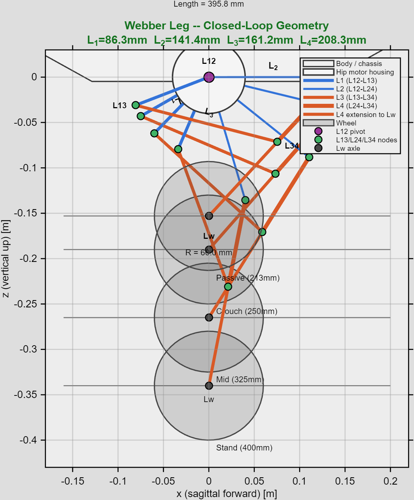
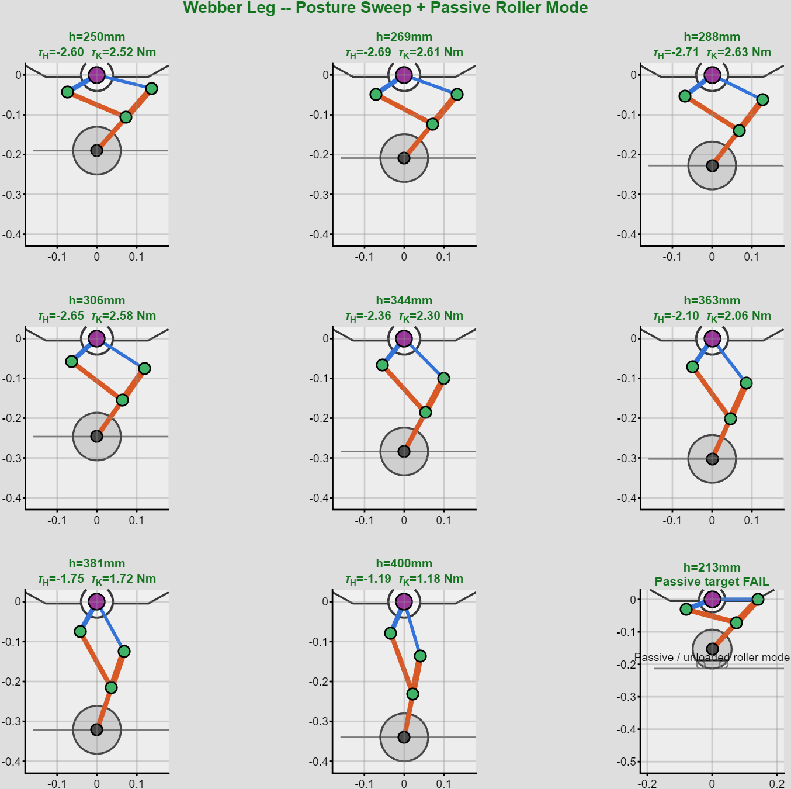
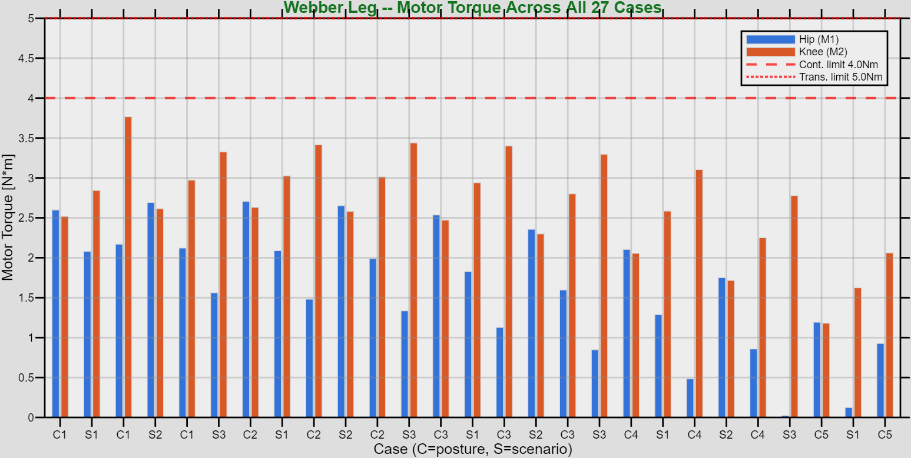
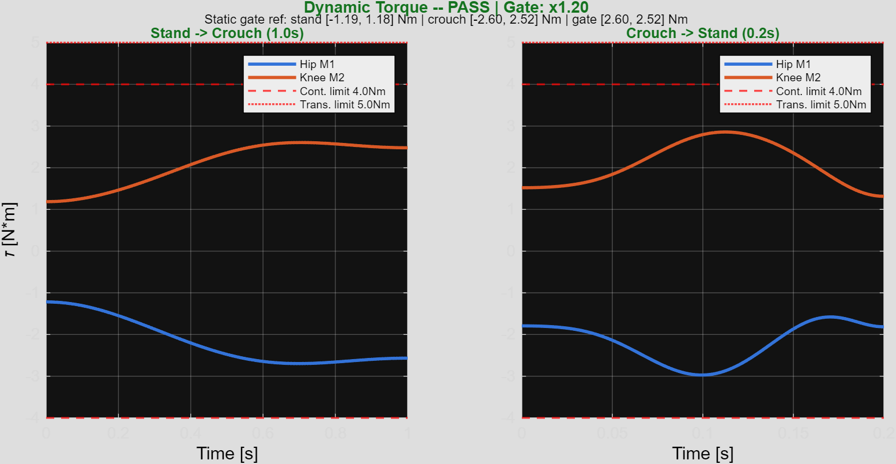

# Webber, Week 0 and Week 1: From Architecture Decisions to a Build-Ready Leg

`Webber` is a wheeled bipedal robot I am building as a base platform for future autonomy and perception work.

The goal was not just to build something that moves. I wanted a platform that is mechanically interesting, useful for future robotics work, and still realistic to execute under a short timeline and limited budget.

The first two weeks of the project were less about CAD and more about reducing guesswork. I split that work into two parts:

- `Week 0`: decide what kind of robot I am actually building though this took up close to 2 weeks
- `Week 1`: validate whether the chosen leg concept is worth carrying into CAD

## Week 0: Architecture Before Geometry

Before opening MATLAB, I spent time looking at existing wheel-legged and legged robots and comparing the kinds of tradeoffs they make well.

At that stage, I was trying to answer a few practical questions:

- where should the motors sit
- what kind of leg mechanism is realistic for this version
- what mass budget should I design around
- what should the first build optimize for: novelty, compactness, torque margin, or speed of execution

### Starting from a rough BOM

I had not designed the chassis yet, but I still needed a realistic starting point for the leg work. So I created a rough BOM first and used the component weights to estimate the chassis and overall mass budget.

That helped in two ways:

- it kept the leg study tied to something close to the real robot instead of an optimistic sketch
- it forced the mechanism decisions to reflect the likely hardware, not an idealized future version

For this phase, the project target was a `6 kg` class robot with a `60 mm` wheel radius, a `400 mm` standing height, and a `250 mm` active crouch.

### Deciding on motor placement

One of the first decisions was to keep both leg actuators at the chassis.

That was important for this robot because it reduces moving mass in the lower part of the leg, makes the linkage easier to package, and gives a better chance of distributing the load across both actuators instead of overworking a distal joint.

For a project like this, that is a better starting point than building a visually interesting leg first and solving the inertia and torque problems later.

### Deciding on the leg mechanism

I looked at a few common wheel-legged directions, including parallel 4-bars, crossed 4-bars, and 5-bar style layouts.

I chose a parallel 4-bar style mechanism for this first version because it gave me the best overall compromise:

- mechanically simple enough to reason about quickly
- straightforward to model and validate
- compatible with the proximal-actuator layout
- easier to hand off into CAD without carrying too much geometric ambiguity

This was not a claim that parallel 4-bars are always better. It was a decision about what made the most sense for Webber right now.

### Fixing the motor first

The next important decision was to lock the motor choice early.

I ordered the motors first and treated the mechanism as something that had to work with those actuators, not the other way around. That changed the whole process. Instead of asking, "what is the coolest leg I can draw," the better question became, "what geometry gives me the best result with the actuator I can actually use."

The current working design limits for the selected actuator are:

- `4.0 N*m` continuous
- `5.0 N*m` transient

Once those limits were fixed, the mechanism problem became much clearer.

By the end of Week 0, I had:

- a wheel-legged robot concept I wanted to build
- a proximal-actuated leg architecture
- a parallel 4-bar mechanism direction
- a rough BOM-based mass budget
- a motor selection that the geometry would have to respect

That was enough to stop researching and start validating.

## Week 1: MATLAB and Simscape

Week 1 was about turning those choices into something testable.

Instead of jumping into CAD, I built a MATLAB workflow to answer a more useful question first:

is this leg geometry actually good enough to build?

The workflow was:

1. define the leg topology and design variables
2. solve inverse and forward kinematics across the full standing-to-crouch range
3. evaluate static torque across all validation load cases
4. reject geometries that violated operating-range constraints
5. run inverse-dynamics validation for stand-to-crouch and crouch-to-stand motion
6. export a SolidWorks-ready handoff with dimensions and loads

### Kinematics first

The first check was simple: can the leg achieve the postures I care about, and can it do that cleanly across the full range?

For this mechanism, that meant solving the linkage through:

- standing
- active crouch
- intermediate postures between the two

If a candidate geometry could not hit those postures cleanly, it was not worth optimizing further.

### Torque across the full operating range

Once the kinematics worked, the next question was torque.

For a closed-loop leg, the link lengths directly change how ground force maps back into actuator effort. That means the geometry is not cosmetic. It changes whether the motor has margin or gets pushed too close to its limit.

So the leg was evaluated across `27` validation cases:

- `9` postures from crouch to stand
- `3` scenarios at each posture

Those scenarios covered:

- static support
- lean
- horizontal acceleration equivalent loading

That was enough to rule out geometries that looked fine in one posture but fell apart when the full operating range was considered.

### Optimization, but with engineering filters

The optimizer was not told to chase a single number.

The search balanced:

- torque demand
- workspace success
- actuator load balance

and penalized designs that became singular, missed the posture targets, or exceeded the motor envelope.

The search itself used a global stage followed by a local refinement stage. That worked well because the geometry space is not smooth enough to trust one local solve from the start, but it still benefits from local polishing once a good region is found.

### Dynamic validation before CAD

Static results are useful, but they are not enough.

A mechanism can look acceptable at hold points and still become poor once it moves. So after the static search, I ran inverse-dynamics validation on the two motions that matter most at this stage:

- stand to crouch in `1.0 s`
- crouch to stand in `0.2 s`

That gave me a much better sense of whether the chosen geometry was only statically acceptable or actually usable in motion.

### Simscape as a validation layer

I also used Simscape Multibody to validate the mechanism motion.

The role of Simscape here was not to replace the MATLAB design loop. MATLAB was the fast mechanism design and screening tool. Simscape was the multibody check that let me verify the motion, confirm the branch behavior, and build confidence before committing the geometry to CAD.

That division of labor made the workflow much cleaner:

- MATLAB for fast iteration and comparison
- Simscape for mechanism sanity checks
- CAD after the geometry had earned the handoff

## The Current Result

The current handoff geometry is:

- `L1 = 86.33 mm`
- `L2 = 141.37 mm`
- `L3 = 161.19 mm`
- `L4 upper = 97.09 mm`
- `L4 extension = 111.24 mm`

At the current stage, that design:

- passes all `27` validation cases
- passes the operating-range geometry guard
- passes the current dynamic validation gate
- stays within the transient motor limit

The current peak static torques are:

- actuator 1: `2.706 N*m`
- actuator 2: `3.767 N*m`

That is a useful result because it is strong enough for mechanical handoff, but it is not pretending to be the final answer to everything.

<video width="640" height="480" controls>
  <source src="../assets/img/webber/webber_phase1_demo.mp4" type="video/mp4">
  Your browser does not support the video tag.
</video>

## Why This Approach Matters

For this kind of robot, the link lengths are not a detail you fill in later. They decide whether the concept is practical.

The first two weeks were really about making that practical question visible as early as possible.

By the end of Week 1, I had something much more useful than a rough mechanism sketch:

- a defined architecture
- a realistic mass target
- a motor-limited design problem
- a validated linkage geometry
- a clear tradeoff to guide the next iteration

That is the kind of progress I was aiming for.

## What Comes Next

The next step is to take the current geometry into CAD and use the exported dimensions and load envelope for the structural work.

After that, the project can branch in one of two directions:

- keep pushing toward a cleaner mechanical handoff for the first build
- revisit the geometry if the passive fold target becomes a stronger requirement

Either way, the project is in a much better position because the early decisions were validated before the expensive design work started.

That was the point of splitting the work this way.
