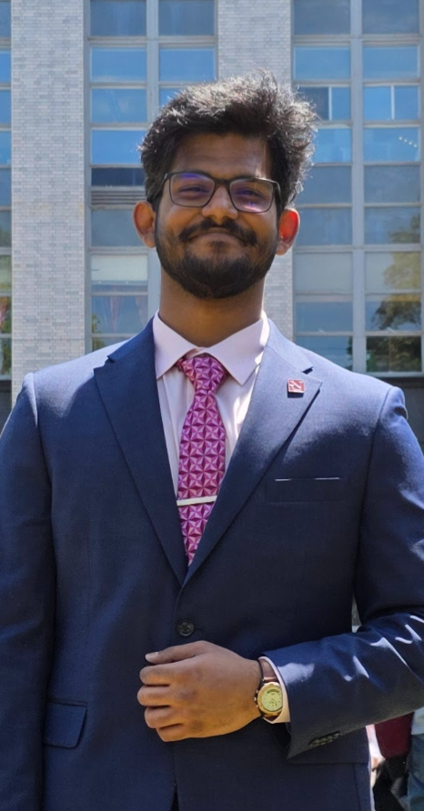

# Vaishnav Raja – Robotics Engineer

## About me
I’m Vaishnav Raja, a Boston-based mechatronics/robotics engineer who likes taking ideas all the way to working software-Perseption, RL and hardware—CAD, PCB, firmware, control, and tests that hold up in front of people. I’ve built AGVs with pick-to-light and stock tracking at Accenture (Best Innovator Award), IoT inventory systems, a SAE BAJA ATV (state runner-ups), and integrations on KUKA and Mitsubishi arms. On the perception side, I’ve worked on 6-DoF pose for bin-picking and robustness for ORB-SLAM3; on the learning side, I’ve trained RL agents for goal-directed navigation.

I care about work with real impact: hands-on builds, measurable results, and frequent demos. I’m comfortable in ambiguous, fast-paced R&D—balancing analysis, design, rapid prototyping, and software integration to get credible results quickly.

Beyond robotics, I’m not always the first to start a chat, but once we get going, I’m all in. I enjoy playing basketball, climbing, motorbiking, and trying new activities.
<!-- These activities keep me creative and resilient — qualities I bring into engineering challenges.   -->
---
## Quick Navigation

[📄 Resume](resume.md){ .md-button .md-button--primary }
[⚙️ Projects](projects.md){ .md-button }

  

---

<!-- RIGHT: Brief, slightly witty pitch + buttons -->

## Got notes, ideas, or a role?

If something here sparked a thought, don’t be shy—say hello. I’m always up for any **feedback** to furthur work upon, **fun ideas** to collab together on, or if you’re **hiring** for a role, let's connect.

<!-- LEFT: Contacts (like the screenshot, but on the left) -->

## Let’s keep in touch

- :material-email: [vaishnav.raja11@gmail.com](mailto:vaishnav.raja11@gmail.com)
- :material-linkedin: [LinkedIn – Vaishnav Raja](https://www.linkedin.com/in/vaishnavraja/)
- :material-github: [GitHub – @VaishnavRaja11](https://github.com/VaishnavRaja11)

